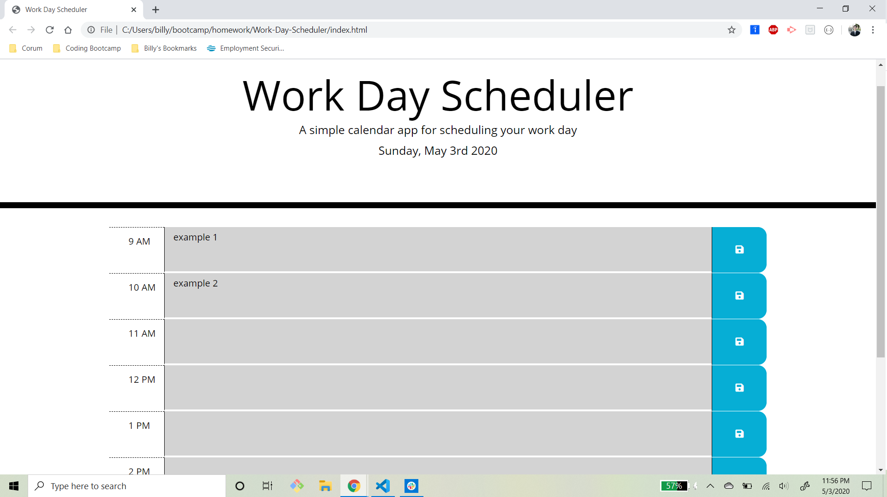

# Work Day Scheduler

This work day scheduler allows a user to save tasks into local storage for each hour of the work day.
The scheduler is color-coded to differentiate between past hours, the current hour and future hours.
Past hours are grey, the current hour is red and future hours are green.

Screenshot of web page:
